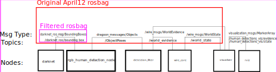

# detection_filter
Node to filter raw human detection locations with the Wire package

# How to try new object pose/filter algorithms on bag
Here is how the human detection pipeline currently works:



Use this command to filter the new bag

```bash
rosbag filter April12_SVD_test_human_detection_tf_off.bag April12_Filtered.bag "topic!='/world_state' and topic!='/world_evidence' and topic!='/ObjectPoses'"
```
